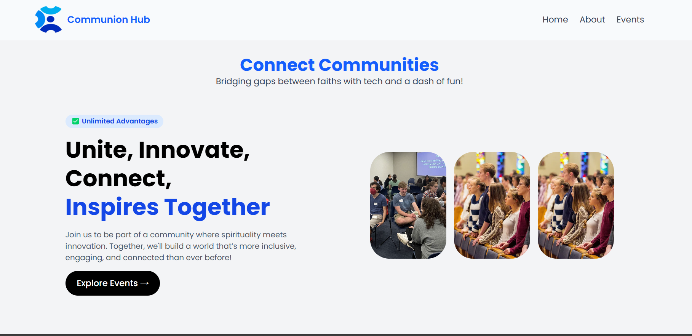
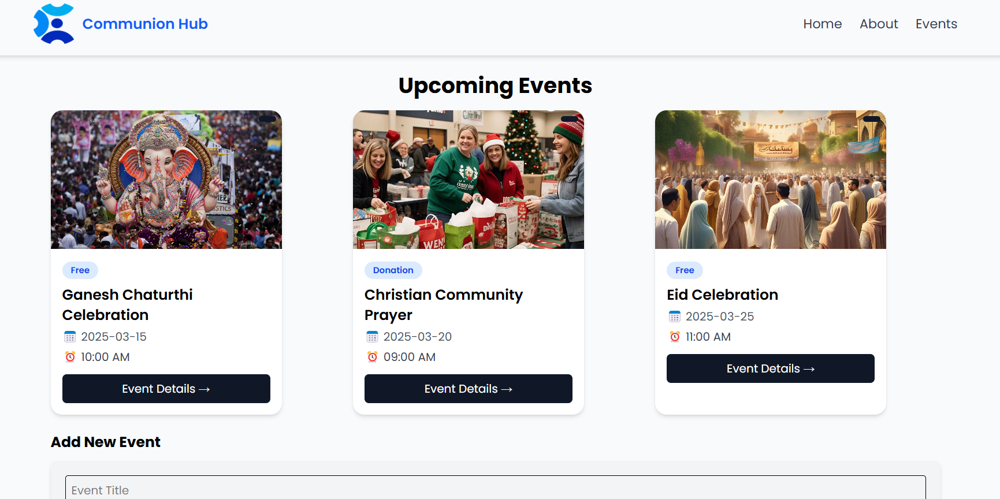

# CommunionHub - Event Management Web App

A **React.js-based web app** that allows users to discover, filter, and add community events.

## 🚀 Features  
- ✅ **Home Page** – Introduction with engaging UI.  
- ✅ **Event Listing Page** – View, filter, and add events dynamically.  
- ✅ **Responsive UI** – Works on **desktop & mobile**.  
- ✅ **Event Storage** – Predefined events from `eventsData.js`.  
- ✅ **Add Events Feature** – Users can create custom events.  
- ✅ **Image Upload Support** – Displays event images.  
- ✅ **Local Storage Persistence** – Keeps events saved even after refresh.  

## 📌 Tech Stack  
- **Frontend:** React.js, Tailwind CSS  
- **State Management:** useState, useEffect  
- **Routing:** React Router  
- **Storage:** Local Storage (for event persistence)  
- **Hosting:** Vercel / Netlify  

## 🛠 Installation & Setup
1. **Clone the Repository**  
   ```sh
   git clone https://github.com/itsPranjul/communion_test.git
   ```
2. **Install Dependencies**  
   ```sh
   npm install
   ```
3. **Run the App Locally**  
   ```sh
   npm start
   ```
4. Open **http://localhost:3000/** in your browser.

## 🚀 Deployment
### Netlify Deployment  
1. Push your project to **GitHub**.  
2. Go to **Netlify** → Click **New Site** → Connect your GitHub repo.  
3. Deploy! 🚀  

### Vercel Deployment  
1. Install Vercel CLI:  
   ```sh
   npm install -g vercel
   ```
2. Deploy:  
   ```sh
   vercel
   ```

## 📸 Screenshots
| Home Page | Events Page |
|-----------|------------|
|  |  |

*(Replace `https://via.placeholder.com/300` with actual screenshot links.)*

## 🤝 Contributing
1. **Fork** the repository  
2. **Create a new branch** (`feature-xyz`)  
3. **Commit your changes** (`git commit -m "Added new feature"`)  
4. **Push to GitHub** (`git push origin feature-xyz`)  
5. Open a **Pull Request**  
 

## 📧 Contact
For any queries, feel free to reach out:  
📩 **Email:** pranjulit4708@gmail.com  
🔗 **Website:** [CommunionHub](https://communionhub.org)  
